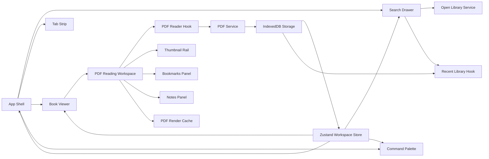

# Online Book Opener

Online Book Opener is a browser-like digital reading workspace for PDFs and public Open Library results.

It combines:
- multi-book tabs
- persistent recent library
- PDF.js rendering
- IndexedDB-backed reading state
- per-book zoom and transparency
- bookmarks and notes
- command-first navigation

## Features

### Reading workspace
- Open multiple books at the same time
- Browser-style tabs with instant switching
- Close tabs independently
- Restore open tabs after refresh

### PDF reading
- Local PDF upload via button or `Ctrl + O`
- PDF.js rendering with lazy-loaded document pipeline
- Cached page bitmaps for smoother revisits
- Single-page and two-page reading modes
- Rendering quality modes: draft, balanced, sharp

### Navigation
- Previous / next navigation
- Bottom thumbnail page rail
- Fast page jumping
- Current page highlighting
- Command palette page jump support

### Personal workflow
- Persistent recent PDF library
- Bookmarks per book
- Notes per page
- Per-book settings persistence

### Search and discovery
- Open Library search drawer
- Metadata cards for unavailable previews
- Public readable results can open inside the workspace when embeddable

## Screenshots

Suggested screenshots to add:
- Main workspace with multiple tabs
- Recent library + Open Library drawer
- PDF thumbnail navigation rail
- Bookmarks and notes side panels
- Command palette

If you want to version screenshots in the repo later, place them under:

```text
/docs/screenshots/
```

## Architecture



## Tech stack
- React
- TypeScript
- Tailwind CSS
- Zustand
- PDF.js
- Framer Motion
- IndexedDB via `idb`
- Lucide icons

## Project structure

```text
src/
  components/
    bookmarks/
    command-palette/
    library/
    notes/
    pdf-viewer/
    search-drawer/
    ui/
  hooks/
  services/
  storage/
  store/
  types-books.ts
```

## Installation

### Prerequisites
- Node.js 20+
- npm 10+

### Setup
```bash
git clone https://github.com/MNPranava/Online_book_opener.git
cd Online_book_opener
npm install
npm run dev
```

### Production build
```bash
npm run build
npm run preview
```

## Keyboard shortcuts

| Shortcut | Action |
|---|---|
| `Ctrl + O` | Upload PDF |
| `Ctrl + K` | Open command palette |
| `Ctrl + Tab` | Switch active tab |
| `Ctrl + W` | Close active tab |
| `+` / `=` | Zoom in active book |
| `-` | Zoom out active book |
| `Esc` | Close command palette |

## Current reading capabilities

### Per-book state
Each book remembers its own:
- current page
- zoom level
- transparency settings
- theme
- page mode
- rendering quality
- bookmarks
- notes

### IndexedDB persistence
The app stores:
- uploaded PDF blobs
- recent library metadata
- open tab sessions
- reading state

## Error handling
Current UX handles:
- unsupported files
- corrupted PDFs
- missing IndexedDB file blobs
- IndexedDB access failures
- Open Library API failures
- reader rendering errors via error boundary

## Build optimization
The app now uses lazy loading for heavy modules:
- PDF reading workspace
- command palette
- PDF.js service chunk

This reduces the initial app bundle significantly while keeping PDF features available on demand.

## Roadmap

### Stabilization / QA
- additional browser QA matrix
- cache telemetry and profiling
- better offline/error recovery messaging

### Next possible enhancements
- search inside PDF
- text highlights / annotations
- import/export bookmarks and notes
- thumbnail virtualization for very large PDFs
- advanced recent library filters

## Development notes

### Why IndexedDB?
Local PDFs are too large for `localStorage`. IndexedDB keeps blobs persistent without bloating Zustand state.

### Why lazy-load PDF features?
PDF.js is heavy. Splitting the PDF viewer and PDF service keeps the first load much faster for non-PDF workflows.

## Status
Current version is focused on:
- stability
- persistent reading workflow
- multi-book productivity
- maintainable architecture

It is now positioned as a production-oriented digital reading workspace rather than a static page-flip demo.
